# Отчёт по проекту docker-swarm. Основы оркестрации контейнеров

## Содержание

1. [Запуск нескольких docker-контейнеров с использованием docker compose](#part-1-запуск-нескольких-docker-контейнеров-с-использованием-docker-compose)
2. [Создание виртуальной машины](#part-2-создание-виртуальных-машин)
3. [Создание простейшего docker swarm](#part-3-создание-простейшего-docker-swarm)
 
## Part 1. Запуск нескольких docker-контейнеров с использованием docker compose

1. Для каждого сервиса создал [dockerfile](services/booking-service/dockerfile). Использовал сборку по типу multi-stage, на выходе получал только артефакты и среду для запуска. Это существенно экономит вес образа. Для сборки и запуска использовал `openjdk:8-jdk-alpine`. Для экономии веса образа для этапа запуска можно было использовать `openjdk:8-jre-alpine`.

> Учёл, что во время запуска контейнера сначала запускается скрипт [wait-for-it.sh](services/booking-service/wait-for-it.sh), который проверяет загрузилась ли база данных postgres.

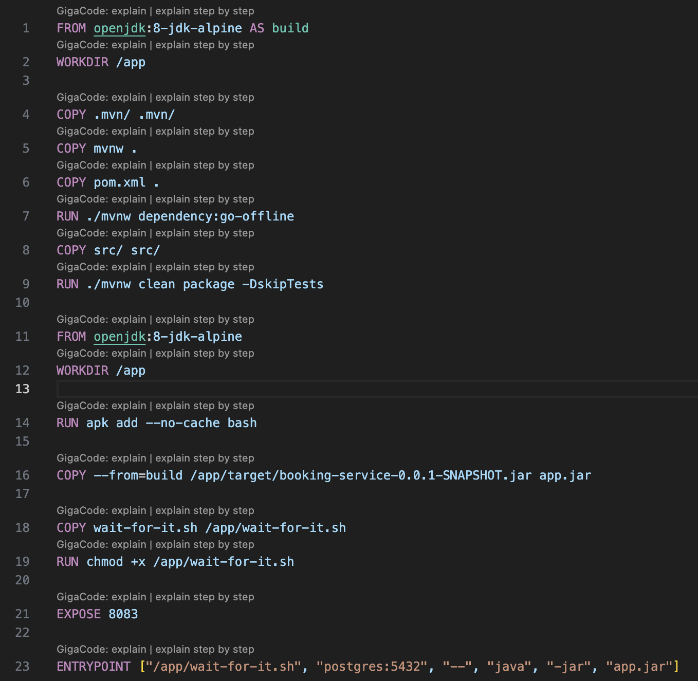

2. На раннем этапе возникла проблема с тем, что вместо файла `mvnw` скачивался только указатель на него. Для решения этой проблемы потребовалась установка `git-lfs`.

3. Используя `dockerfile` создал локальные образы с тегом latest.
Для этого выполнял команды `docker build -t [name-of-service]-service:latest`

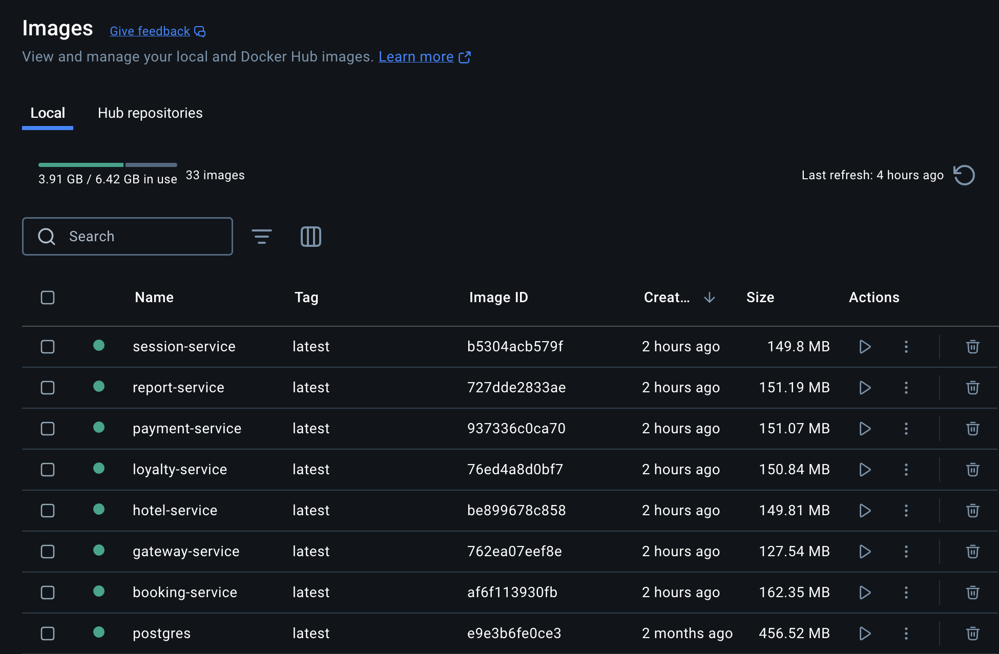

4. Создал [docker-compose.yml](../docker-compose.yml), куда добавил сборку из локальных образов. Файлы .env, которые содержат в себе переменные окружения. Учёл последовательность запуска сервисов через depends-on.

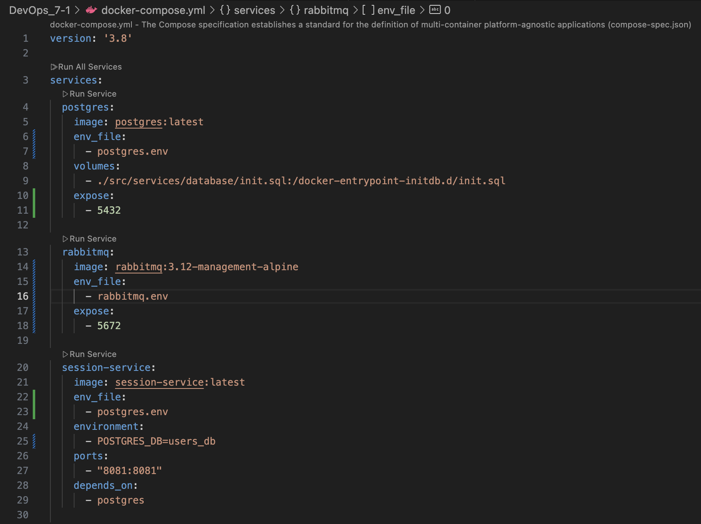

5. Запустил контейнеры командой `docker-compose up`. Все контейнеры запустились успешно.

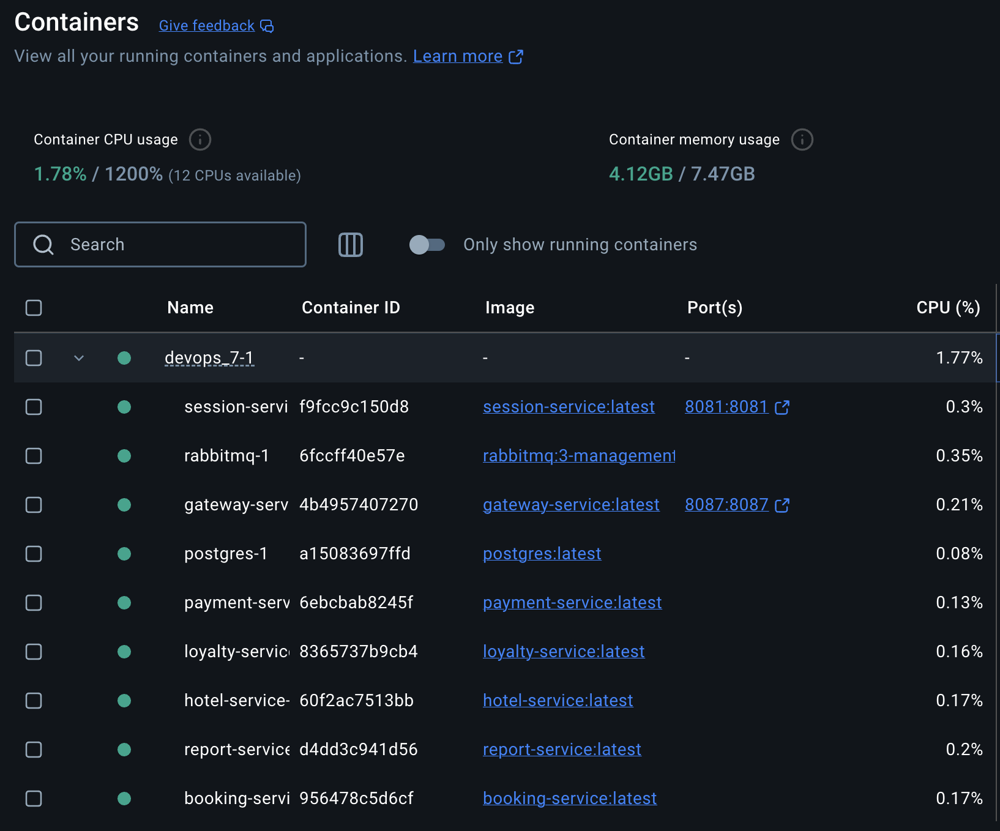

6. Установил postman в виде расширения для vs code. Подгрузил тесты из файла [application_tests.postman_collection.json](application_tests.postman_collection.json).
Запустил тесты, все успешно пройдены.

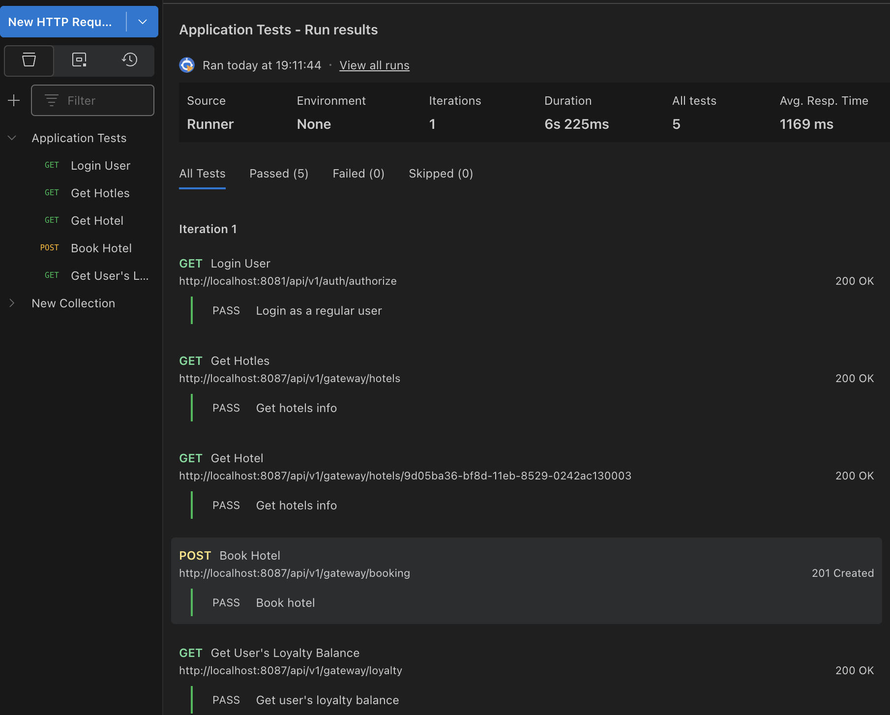

## Part 2. Создание виртуальных машин

1. Установил Virtual Box 7.1.6 и VirtualBox Extension Pack.

2. Установил Vagrant командой `brew install vagrant`.

3. В корневой папке проекта инициализировал [Vagrantfile](../Vagrantfile) с настройками для vagrant командой `vagrant init`, создал папку [vagrant_shared](../vagrant_shared/).

4. Настроил конфигурацию для запуска виртуальной машины на базе `hashicorp-education/ubuntu-24-04`, которая копирует исходный код веб-сервиса на виртуальную машину. Для загрузки образа с vagrant cloud потребуется VPN.

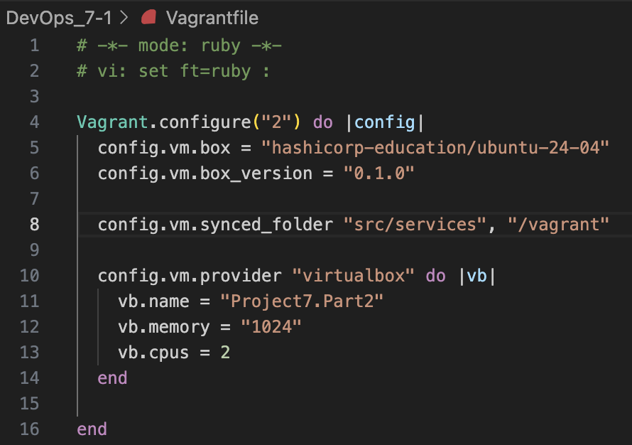

5. Запустил сборку виртуальной машины командой `vagrant up`.

6. Подключился к ней из терминала командой `vagrant ssh` и проверил наличие файлов командой `ls /vagrant`.

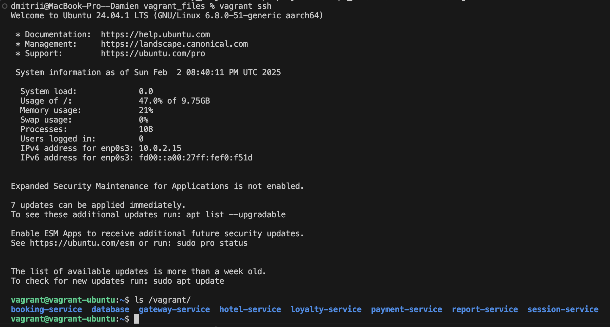

7. Командой `vagrant halt` остановил работу виртуальной машины, командой `vagrant destroy` уничтожил её.

## Part 3. Создание простейшего docker swarm

1. Настроил [Vagrantfile](../Vagrantfile) для создания трёх машин: manager01, worker01, worker02 c shell-скриптами для установки docker внутрь машин, инициализацией и подключением к docker swarm.

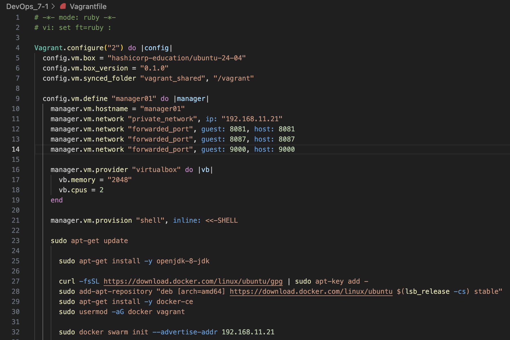

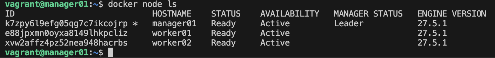

2. Загрузил локальные образы в docker hub и модифицировал [docker-compose.yml](../vagrant_shared/docker-compose.yml), чтобы образы грузились с удалённого репозитория.

3. Перенёс `docker-compose.yml` в общую папку [vagrant_shared](../vagrant_shared/), поднял виртуальные машины. Зашёл на manager01 командой `vagrant ssh manager01`. Далее создал оверлей сеть командой `docker network create --driver overlay overlay_network`. Затем запустил стек сервисов командой `docker stack deploy --compose-file /vagrant/docker-compose.yml project7`.

Проверил успешность запуска: `docker stack services project7`.

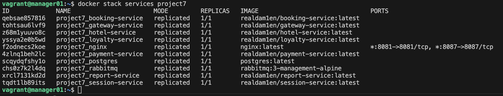

4. Сделал недоступными напрямую gateway и session services. Настроил прокси на базе nginx для доступа к ним. Иземенённый файл [docker-compose.yml](../vagrant_shared/docker-compose.yml) и [nginx.conf](../vagrant_shared/nginx.conf) скопировал в папку `vagrant_shared` и синхронизировал командой `vagrant rsync`.

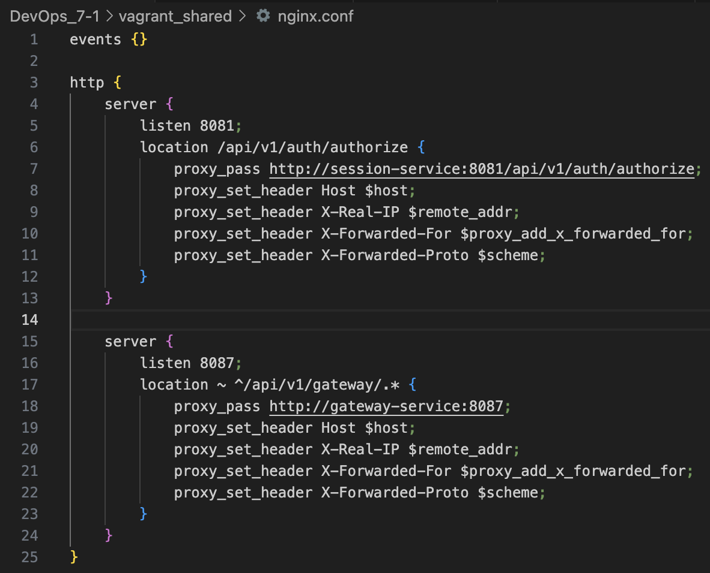

5. Провёл тесты postman. Все завершились успешно.

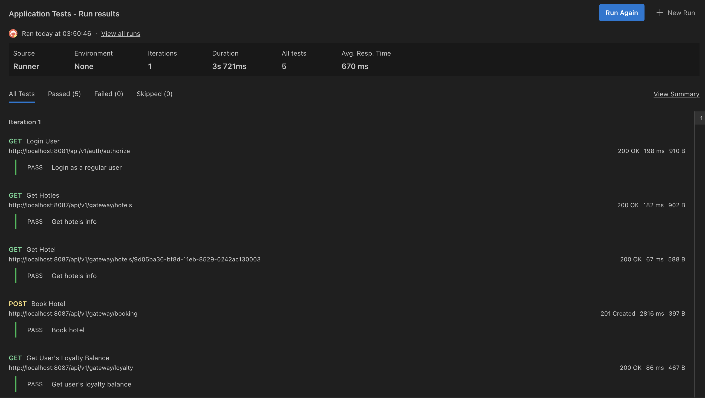

6. Отчёт о распределении контейнеров по узлам.

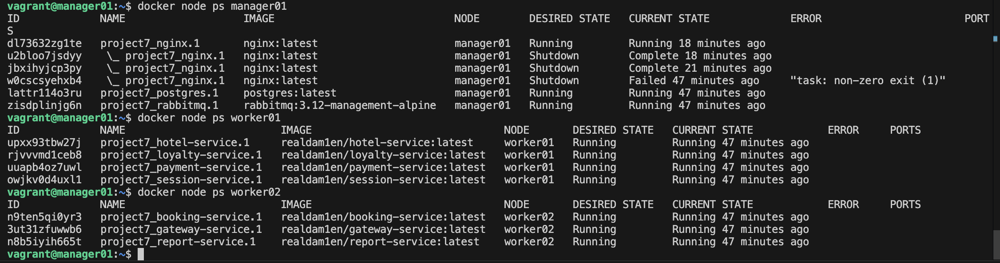

7. Добавил файл [docker-portainer.yml](../vagrant_shared/docker-portainer.yml), который устанавливает portainer на ноду manager01 и portainer-agent на все ноды.

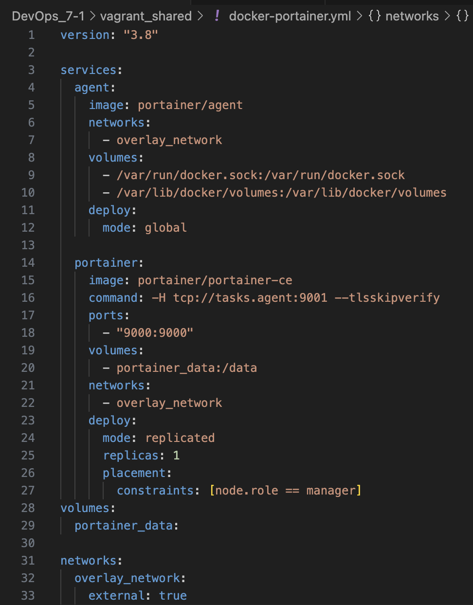

Зашёл по ssh на manager01 и запустил команду `docker stack deploy --compose-file /vagrant/docker-portainer.yml portainer`.
После настройки portainer получил визуализацию распределения задач по нодам.

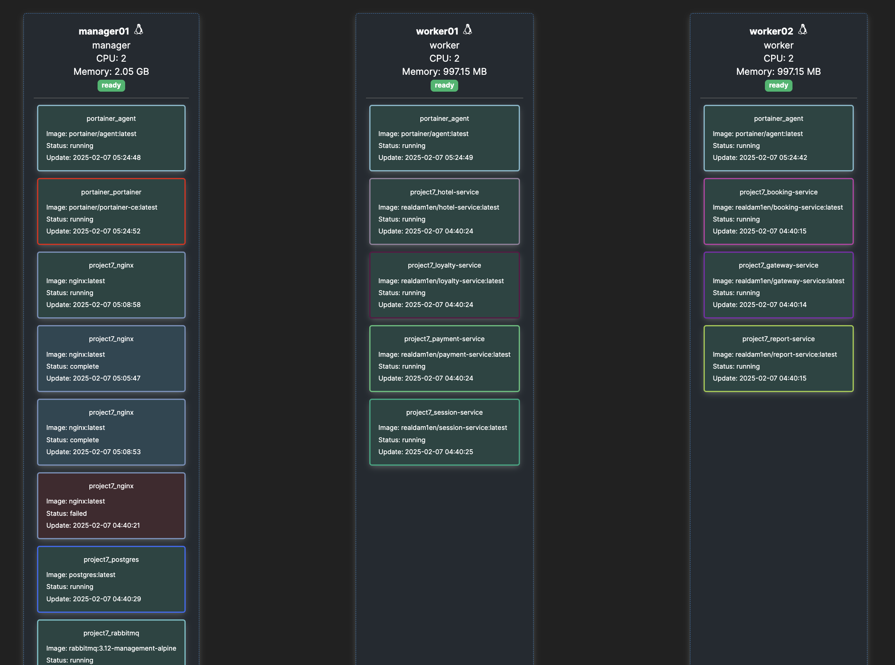

## Итог

Создание проекта с микросервисной архитектурой дало мне практический опыт в развёртывании и управлении контейнерами с использованием Docker Compose и Docker Swarm, а также оптимизации образов и настройке зависимостей и условий запуска для обеспечения масштабируемости и устойчивости. Позволило больше узнать о том, как собираются проекты на Java и работает maven-wrapper, а инструменты Vagrant, Postman и Portainer помогли расширить навыки в настройке сред разработки, тестировании API и визуальном управлении кластерами.

[К содержанию](#содержание)